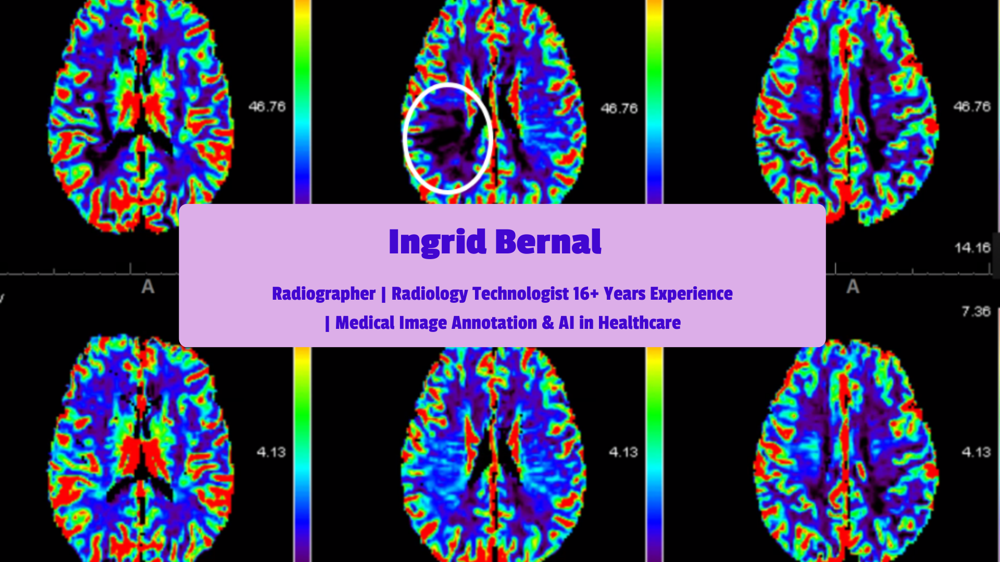

# 👩‍⚕️ About Me
☢️ Bilingual Radiology Technologist with 16+ years of experience in X-ray, CT, MRI & Mammography.  
Currently transitioning to **Medical Image Annotation** and AI in Healthcare through hands-on practice with CVAT and public datasets (NIH Chest X-ray, etc.).  
Detail-oriented, clinically accurate, and passionate about improving diagnostic imaging with technology.

## 🌐 Socials

# 💻🚑 Tech & Clinical Stack
  
  
  
  
  
  
  

# 📊 GitHub Stats
 
 

## 🏆 GitHub Trophies

### ✍️ Random Dev Quote

### 🔝 Top Contributed Repo

### 🫁 Featured Portfolio
**Chest X-ray Annotation Portfolio**  
  
15 annotated images (pathologies + artifacts like pacemaker, CVC, sternal wires)

🩻 Coming soon: Mamografía, CT y RM portfolios

---

