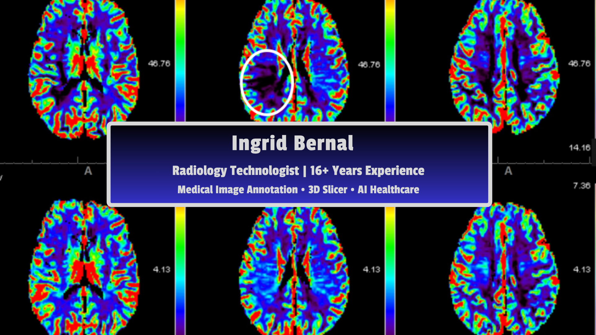

# 👩‍⚕️ Ingrid Bernal

Radiology Technologist with 16+ years in diagnostic imaging (X-ray, CT, MRI, Mammography).  
Leveraging clinical precision and domain expertise in medical image annotation, AI training datasets and volumetric segmentation (3D Slicer).  
Remote - Chile | Open to Worldwide Freelance/Contract

## 🌐 Connect
  
📩 ingridbm5184@gmail.com

## 💻 Tech & Clinical Stack
  
  
  
  
  
  
  

## 📊 GitHub Stats
  
  

## 🏆 GitHub Trophies

## 🫁 Featured Portfolio
**Medical Image Annotation Portfolio**  
High-precision labeling of pathologies and artifacts for AI training in healthcare.  
- Chest X-ray – 15 images  
- Mammography – 9 images  
- CT – 8 images (axial views)  
- RM – 3D volumetric segmentation example (brain tumor with 3D Slicer)

**Annotation Methodology & Guidelines**  
Clinical criteria, polygon-preferred protocols, edge-case handling  

## ☢️ Open to Opportunities
Remote freelance / contract / full-time worldwide in:  
- Medical Image Annotation & 3D Slicer roles  
- AI Data Labeling / Training Datasets  
- Clinical Subject Matter Expert (SME)  
- Radiology Informatics & Workflow Support  

Thanks for visiting! 💙
